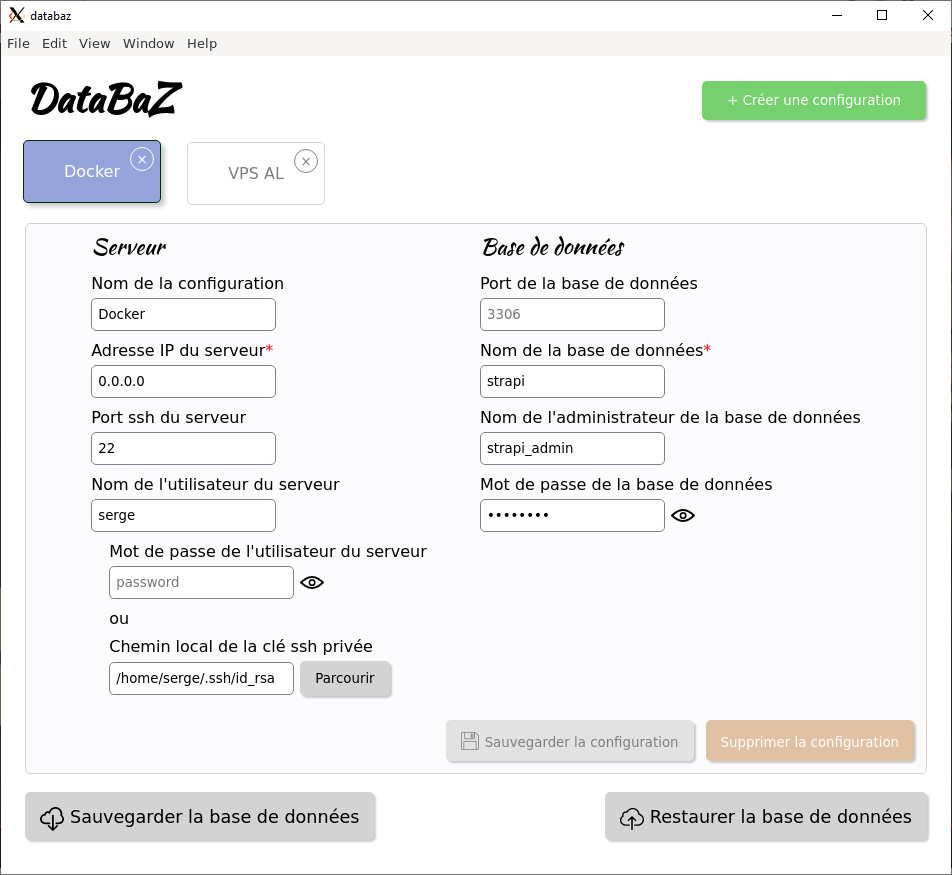

# Databaz

Utilitaire de sauvegarde et d'upload de bases de données MySql/MariaDB.



## Installation

```
npm install
```

## Compile avec hot-reloads pour le développement

```
npm run serve
```

### Compile et minifie pour la production

```
npm run build
```

### Lancer les tests unitaires

```
npm run test:unit
```

### Lancer les tests e2e

```
npm run test:e2e
```

### Linter

```
npm run lint
```

### Configurations Vue-CLI

Voir [la documentation](https://cli.vuejs.org/config/).
